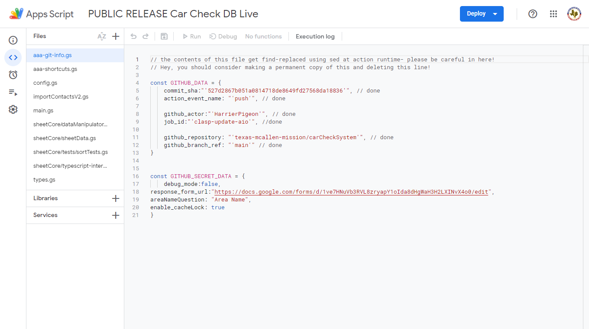
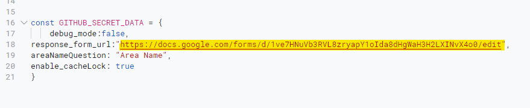
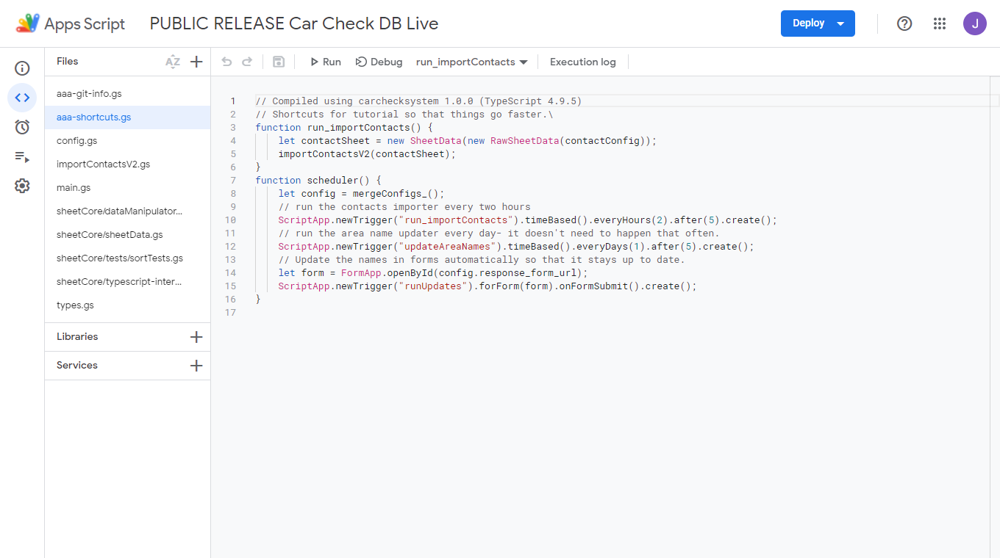

# Getting Started

*This guide assumes that you don't know very much about programming.  Some sort of technical background would be ideal, though.*

## System Explainer

Every month, cars need to be inspected.  Collecting the results and organizing them is something that takes a while, when done automatically.  However, since it's mostly the same stuff month after month that needs to be reported, this problem lends itself nicely to automatic systems.  The system that we've built handles recording data put in from missionaries as well as combining it with information about their area[^1].

The first thing you'll need to do is create a copy of the sheet we store everything in, which can be found [here.](https://docs.google.com/spreadsheets/d/1OXoJZ9xxGZOkut35Z47ZQKExe-LRvOZf_fGfthtlGjI/edit?resourcekey#gid=662692018)  This needs to be done with your mission's ``@missionary.org`` email account, otherwise we won't be able to access the data stored in there by IMOS.

First, go to ``File`` and click ``Make a Copy``:

And then you'll get a dialog that looks like this:

We'd recommend moving it to its own folder (something like "Vehicle Coordinator" or "Car Checks" or something like that.).  You might be wondering why there's a warning that says something about Apps Script - well, that's where the magic happens!

Google automatically makes a copy of the linked Form when you make a copy of the Sheet it's attached to, but sometimes it doesn't quite make it into the right folder.  Because this is a Google thing, there isn't much you can do about that other than search for "Copy of PUBLIC RELEASE" in Drive and filter it down to the ``Form`` filetype.

Once you've found it, go ahead and move it to the same spot as your Sheet.  Again, we highly recommend putting this into a folder where it's less likely to get deleted on accident.

## Overview of the Sheet and Form

### Car Check Form

Here's what the form looks like for you, and for the people submitting:

| Editors | Viewers |
| :---: | :----: |
|  |  |

You may notice that there aren't any area names yet.  That's fine, we'll get to that in a minute!

### Car Check Sheet

*We like to call these types of sheets something like ``Car Check Database`` or similar*

Here's what the landing page looks like:

Before we get any further into the sheet, we need to get area data in and working- for that, we need to go and run the contact importer.

### The Apps Script Environment

Okay, so you don't really need to know that much about this to get around and get this started, but here's a basic overview:

On the left side, you can see the file explorer, and navigate between code files[^2].  Before we get any further, copy the URL from your form and replace the demo version with yours:

This is how we tell the script which form to stick area names into.

Next, navigate to ``aaa-shortcuts`` in the Apps Script editor- we're going to get data into your sheet, and then update the area names.

[^1] missionary names, zones and districts, and some vehicle information.

[^2] In the AppsScript environment, everything is treated like a global variable- there's no concept of import/export like there is in NodeJS.