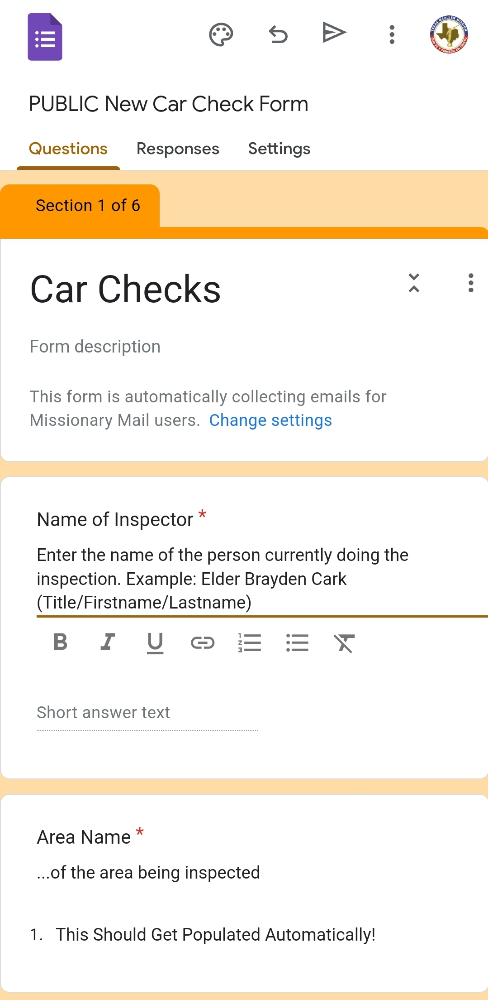
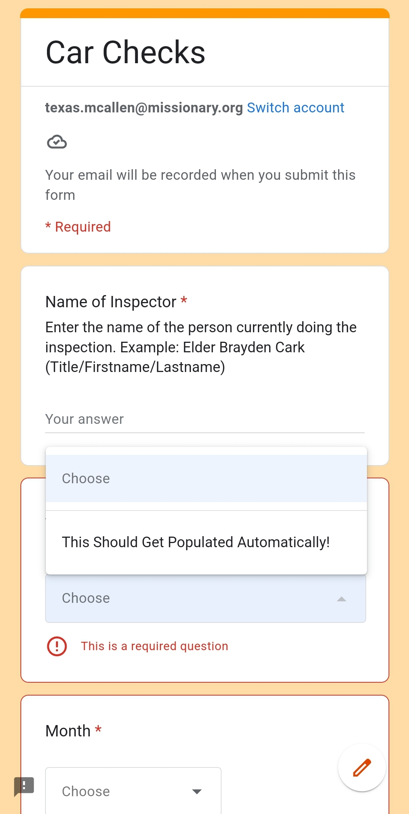
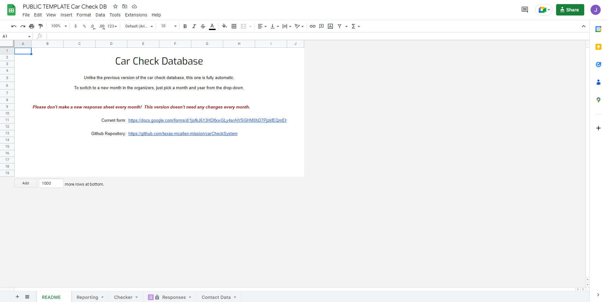
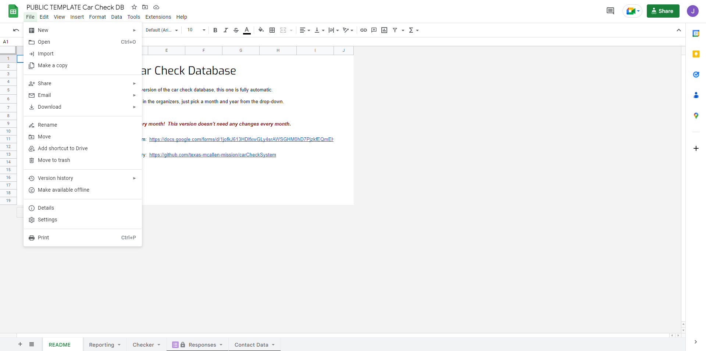
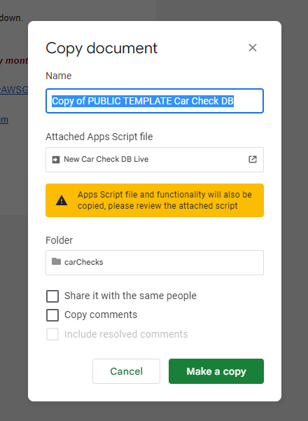

# Getting Started

*This guide assumes that you don't know very much about programming.  Some sort of technical background would be ideal, though.*

## System Explainer

Every month, cars need to be inspected.  Collecting the results and organizing them is something that takes a while, when done automatically.  However, since it's mostly the same stuff month after month that needs to be reported, this problem lends itself nicely to automatic systems.  The system that we've built handles recording data put in from missionaries as well as combining it with information about their area[^1].

The first thing you'll need to do is create a copy of this form and the sheet we store everything in, which can be found [here.](https://drive.google.com/drive/folders/1HnVDuuphyQnM2Qdk_SFgnXxUgT-xUA0z)

## Overview of the Sheet and Form

### Car Check Form

Here's what it looks like for you, and for the people submitting:

| Editors | Viewers |
| :---: | :----: |
|  |  |

You may notice that there aren't any area names yet.  That's fine, we'll get to that in a minute!

### Car Check Sheet

*We like to call these types of sheets something like ``Car Check Database`` or similar*

Here's what the landing page looks like:

First, go to ``File`` and click ``Make a Copy``:

And then you'll get a dialog that looks like this:

You might be wondering why there's a warning that says something about Apps Script - well, the Apps Script programming environment is where we keep all the code that does the work for us!  This is how we get area names and stuff updated!

Before we get any further into the sheet, we need to get area data in and working- for that, we need to go and run the contact importer.

### The Apps Script Environment

[^1] missionary names, zones and districts, and some vehicle information.
