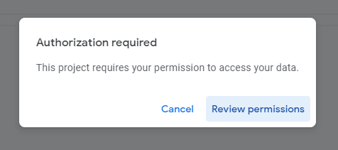

# Getting Started

*This guide assumes that you don't know very much about programming.  Some sort of technical background would be ideal, though.*

## System Explainer

Every month, cars need to be inspected.  Collecting the results and organizing them is something that takes a while, when done automatically.  However, since it's mostly the same stuff month after month that needs to be reported, this problem lends itself nicely to automatic systems.  The system that we've built handles recording data put in from missionaries as well as combining it with information about their area[^1].

The first thing you'll need to do is create a copy of the sheet we store everything in, which can be found [here.](https://docs.google.com/spreadsheets/d/1OXoJZ9xxGZOkut35Z47ZQKExe-LRvOZf_fGfthtlGjI/edit?resourcekey#gid=662692018)  This needs to be done with your mission's ``@missionary.org`` email account, otherwise we won't be able to access the data stored in there by IMOS.

First, go to ``File`` and click ``Make a Copy``:

And then you'll get a dialog that looks like this:

We'd recommend moving it to its own folder (something like "Vehicle Coordinator" or "Car Checks" or something like that.).  You might be wondering why there's a warning that says something about Apps Script - well, that's where the magic happens!

Google automatically makes a copy of the linked Form when you make a copy of the Sheet it's attached to, but sometimes it doesn't quite make it into the right folder.  Because this is a Google thing, there isn't much you can do about that other than search for "Copy of PUBLIC RELEASE" in Drive and filter it down to the ``Form`` filetype.

Once you've found it, go ahead and move it to the same spot as your Sheet.  Again, we highly recommend putting this into a folder where it's less likely to get deleted on accident.

## Overview of the Sheet and Form

### Car Check Form

Here's what the form looks like for you, and for the people submitting:

| Editors | Viewers |
| :---: | :----: |
|  |  |

You may notice that there aren't any area names yet.  That's fine, we'll get to that in a minute!

### Car Check Sheet

*We like to call these types of sheets something like ``Car Check Database`` or similar*

Here's what the landing page looks like:

Before we get any further into the sheet, we need to get area data in and working- for that, we need to go and run the contact importer.

### The Apps Script Environment

Okay, so you don't really need to know that much about this to get around and get this started, but here's a basic overview:

On the left side, you can see the file explorer, and navigate between code files[^2].  

## Making The Changes We Need

Before we get any further, copy the URL from your form and replace the demo version with yours:

This is how we tell the script which form to stick area names into.

Next, navigate to ``aaa-shortcuts`` in the Apps Script editor- we're going to get data into your sheet, and then update the area names in the Form's dropdown so that things show up.

At the top, you can see where we run code:

We need the following scopes for these reasons:

| Scope | Explanation |
| :--- | :--- |
| Google Drive | Part of accessing Google Sheets |
| Contacts | This is how we access the information stored about areas in your mission |
| Google Sheets | This is where we store data |
| Forms | Updates area names |
| Run when not present | Automatic updates to area names, form submissions |

If you click on the function name you can choose which function to execute.

First, we'll run ``run_importContacts`` so that we can get your area data loaded up.  (We also use this to get some vehicle information automatically.)

The first time you run anything, you'll get this lovely pop-up that asks for authorization.  You'll need to approve it in order to continue.

> *If you get errors, please ensure that you're running this as your mission office's missionary.org email account, and that [Google Contacts](https://contacts.google.com) has a label called ``IMOS Roster`` with contacts in it.  If you still have problems, please open an issue on [this repo](https://github.com/texas-mcallen-mission/carCheckSystem) and we'd love to help!*

To manually update the area names and make sure everything works, navigate to ``main.gs`` in the sidebar and run ``updateAreaNames``.

If you go to your form now, the "Area Names" dropdown should have different stuff in it[^3]!

Because doing work manually isn't fun (especially when you forget!) we automated it!  Go back to ``aaa-shortcuts.gs``, and run the ``scheduler`` function, and then click on the clock.  In the future, your area names will be kept up to date, and the extra data we grab from Contacts will get added to the data submitted by your missionaries.  At this point, you should be done with the Apps Script environment.

## Testing

Go ahead and submit a dummy response.  Fill it out, and submit it.  Then go back to the ``Responses`` tab in your Sheet.  If you've already set up automated triggers, you'll notice some information in there that wasn't included in the submission- the ``Zone``,``AreaId``,``imos_vin``,``hasVehicle``,``imos_mileage``, and ``combined_names`` columns all get data automatically added in from the ``Contact Data`` sheet, which is hidden by default. ``Pulled`` gets marked as true once that process has completed.

Here's what it looks like for our demo:

## Sheets - Usage Guide

### Reporting Page

Everybody, including missionaries, unfortunately, doesn't do stuff quite exactly when you want, nor do they always remember to do stuff.  For that reason, we have to ensure that they did what we asked them to. Without further ado, here's the reporting tab:

We organize data by year and month- pick the month & year you picked for your demo entry, and it will show up in here.

Each zone has a progress bar that turns green once everybody with a car in that zone has submitted.

### Dashboard Page

This is where we view the results of our car checks.  Like the ``Reporting`` tab, it has year/month dropdowns where you can choose which year/month to view.  TBH, this is not the prettiest sheet, but it was a *massive* improvement over the previous one, and that made the office peeps really happy, so if you want to spend time beautifying it, knock yourself out.

At this point, the car check system is online!  The only thing you have to do now is share it with the world and hope they don't break anything on the way.

## Extending / Modifying Things

Everything besides the ``Area Name``, ``Month``, and ``Year`` questions can be modified or deleted as you desire!  You can also add more questions- when you do, columns will automatically show up in the dashboard, but any conditional formatting or changes you might wish to the layout are left up to you to do.

If you're a semi-capable programmer, all the code is available on [GitHub](https://github.com/texas-mcallen-mission/carCheckSystem) and you can fork it and mess with it from there!  We use Continuous Integration via a [workflow we built](https://github.com/texas-mcallen-mission/deploy-google-app-script-action-typescript) and built a [library that gets used in several other systems named ``sheetCore``](https://github.com/texas-mcallen-mission/sheetCore).  Nearly all the code is written in TypeScript, which has to be converted into JavaScript (we do this automatically with the above CI workflow) but that makes it way easier to maintain long-term.

If you want updates in the future, if there are any, you'll need to fork the repo and then use that.  The ``sheetCore`` repo should have a guide for getting started with CI you can follow to get up to speed as well.

## Notes, Footnotes

So it's clear: you are the only one who will have access to this stuff- we don't make copies of your data nor do anything malicious.  If you don't believe us, the code is all right there and you can read it all.

[^1] missionary names, zones and districts, and some vehicle information.

[^2] In the AppsScript environment, everything is treated like a global variable- there's no concept of import/export like there is in NodeJS.

[^3] We obviously can't go and put our own data in the demo, because we don't want to leak things that can get our people hurt...
